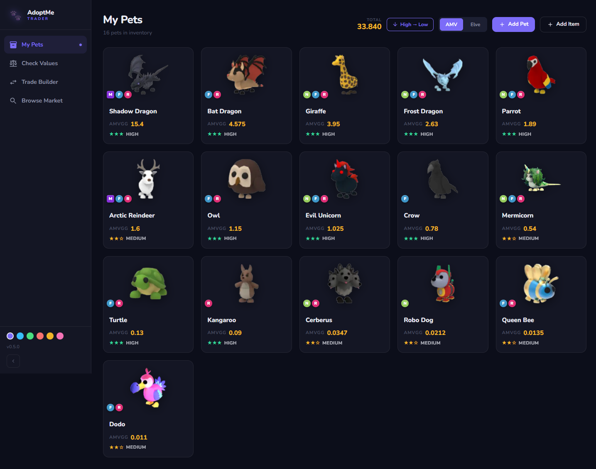
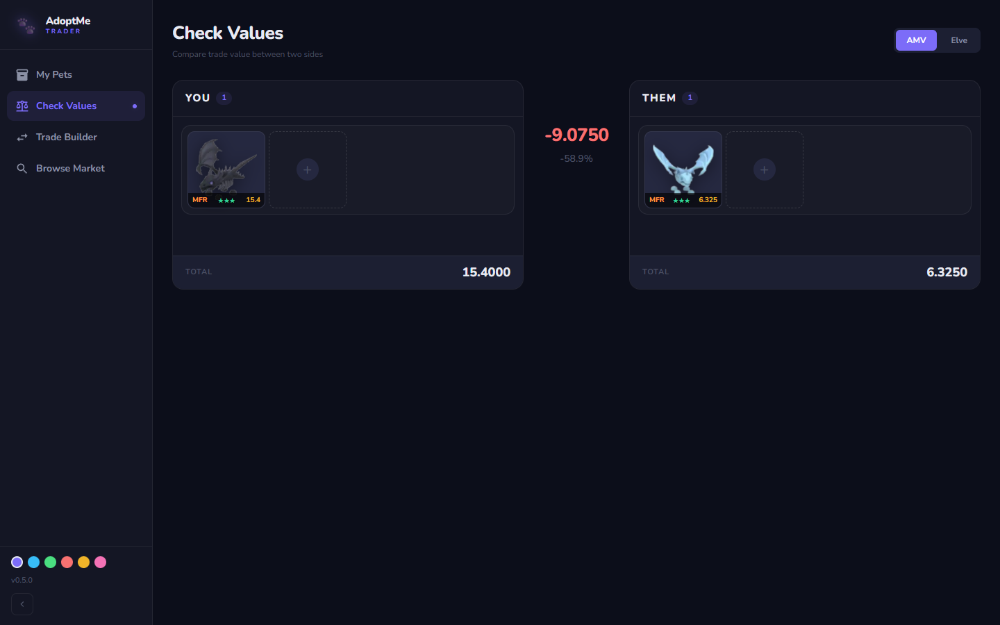
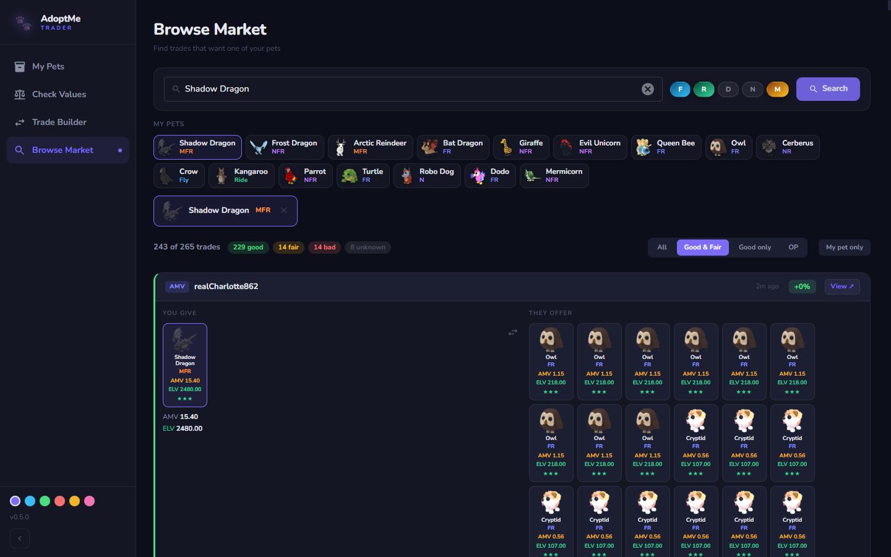

# AdoptMe Trader

A trade manager for **Roblox Adopt Me** that helps players value pets and judge whether a trade is fair. It cross-checks two community value sources (**AMVGG** and **Elvebredd**), factors in each pet's demand, scores trade fairness, and lets you browse the live AMVGG market for offers on a pet you want to give away.

**Live app:** https://amtrader.fly.dev

> Built as a portfolio project. Not affiliated with Roblox, Adopt Me, AMVGG or Elvebredd — value data belongs to those communities and is used here for reference.

---

## Screenshots

**My Pets** — inventory with per-form values, demand ratings, and a running total.



**Check Values** — two-sided comparison with the value gap and a fairness verdict.



**Browse Market** — scans live AMVGG trades for offers on a pet you want to give away, with AMV + ELV values per pet and Good / Fair / OP filters.



---

## What it does

Trading in Adopt Me is all about *value* and *demand*, and the numbers live across a few community sites that don't agree with each other. This app pulls them into one place:

- **My Pets** — Build your inventory (pets + non-pet items like Pet Wear, Eggs, Vehicles…). Each card shows its value for the selected form and a demand rating. Total inventory value, sortable by worth.
- **Check Values** — Two-sided comparison (YOU vs THEM). Pick pets on each side and see the value gap, per slot, switching between AMVGG and Elvebredd.
- **Trade Builder** — Assemble an offer and get a demand-adjusted fairness score, plus pet suggestions within a ±20% tolerance to balance the trade.
- **Browse Market** — Search the live AMVGG market for trades asking for a pet you want to offer. Filters for Good / Fair / OP deals (adjustable threshold), with both AMV and ELV values shown side by side.
- **5 color themes**, persisted locally.

Pets come in **forms** (Fly / Ride / Neon / Mega and combinations), and each form has its own value — the app derives all of them from the base values using the same multiplier formula as the AMVGG calculator.

## Tech stack

- **Frontend:** Vue 3 (Composition API), Quasar v2, Pinia, TypeScript
- **Backend:** Quasar SSR running on a Node 22 server with Express-style middleware
- **Hosting:** Fly.io (single machine, São Paulo region), Docker multi-stage build
- **Data:** static value caches (JSON) warmed into memory at startup

## Architecture

The app is **server-side rendered**. The browser only ever talks to this app's own API — external sites (AMVGG, Elvebredd) are contacted server-side, never from the client.

```
Browser (src/)                SSR middleware (src-ssr/middlewares/)
─────────────────             ─────────────────────────────────────────────
fetch('/api/...')      →      ratelimit → auth → api → render
                              api handlers read from in-memory caches:
                                detailsCache    ← src/data/amv-cache.json
                                elveValuesCache ← src/data/elve-cache.json
```

**Static value cache.** Values are pre-fetched locally (`npm run fetch-values`) and committed as JSON, then baked into the Docker image and loaded into memory on boot. This keeps the app fast and avoids hammering the source sites on every request. Elvebredd is fetched via `curl` to get past its Cloudflare TLS fingerprint check (Node's `fetch` gets a 403).

**Middleware chain:**
- `ratelimit` — in-memory per-IP limiter (tighter on the one endpoint that makes an outbound request)
- `auth` — optional shared-password gate (HMAC-signed cookie, timing-safe compare); opt-in via the `AUTH_PASSWORD` env var, off by default
- `api` — all `/api/*` handlers + cache warming + market browsing
- `render` — Quasar SSR renderer

### Key directories

```
src/
  pages/        My Pets, Check Values, Trade Builder, Browse Market
  stores/       Pinia: inventory (localStorage-backed) + values cache
  composables/  form picker, theming
  data/         committed value caches (amv / elve / items)
src-ssr/
  middlewares/  ratelimit, auth, api, render
scripts/
  fetch-values.mjs   regenerates the value caches
```

## Running locally

Requires **Node ≥ 22** and `curl` on your PATH (used by the value fetcher).

```bash
npm install
npm run dev          # Quasar SSR dev server with hot-reload
```

Other scripts:

```bash
npm run build         # production SSR build → dist/ssr/
npm run fetch-values  # regenerate src/data/*.json from AMVGG + Elvebredd
```

The app runs open by default. To put it behind the shared-password login, set `AUTH_PASSWORD` in the environment.

## License

[MIT](./LICENSE)
