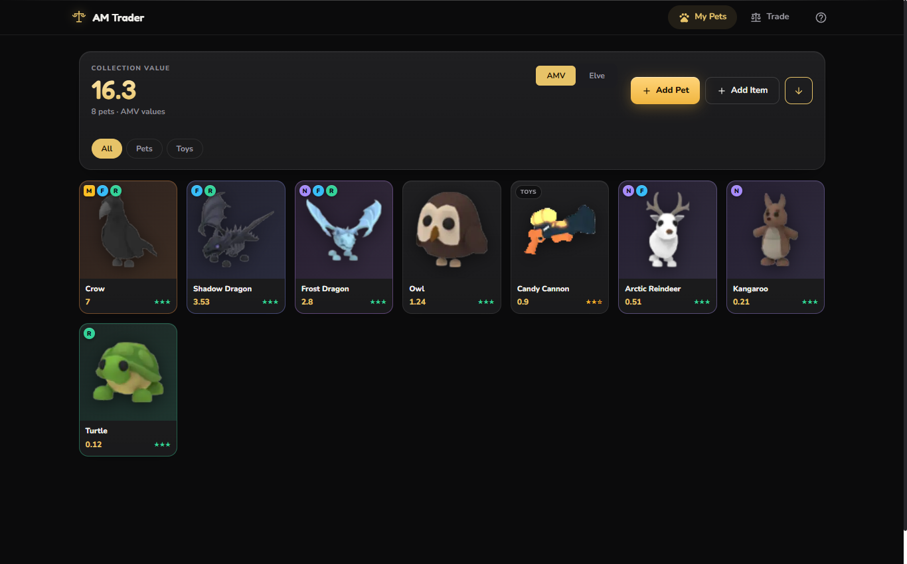
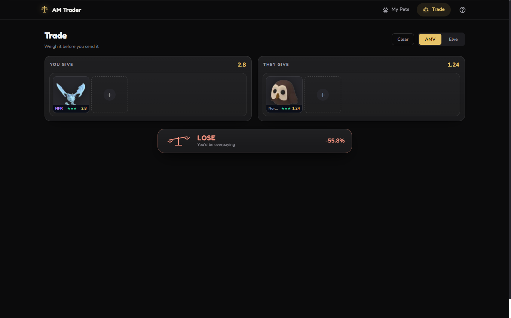

# AdoptMe Trader

A trade manager for **Roblox Adopt Me** that helps players value pets and judge whether a trade is fair. It cross-checks two community value sources (**AMVGG** and **Elvebredd**), factors in each pet's demand, and scores trade fairness.

**Live app:** https://amtrader.fly.dev

> Built as a portfolio project. Not affiliated with Roblox, Adopt Me, AMVGG or Elvebredd — value data belongs to those communities and is used here for reference.

---

## Screenshots

**My Pets** — portfolio-style inventory: collection total up top, dense tile grid, tap a pet for details.



**Trade** — "you give / they give" with the Fair Scale: the beam tips toward the heavier side and calls WIN / FAIR / LOSE.



---

## What it does

Trading in Adopt Me is all about *value* and *demand*, and the numbers live across a few community sites that don't agree with each other. This app pulls them into one place:

- **My Pets** — Build your inventory (pets + non-pet items like Pet Wear, Eggs, Vehicles…) and see the collection's total worth at a glance. Each tile shows the pet's value for its form and a demand rating; tapping one opens a detail sheet with both sources, demand, and form editing.
- **Trade** — "You give / They give". Pick pets on each side and the Fair Scale weighs the trade live: the beam tips toward the heavier side and calls **WIN / FAIR / LOSE** with the exact percentage, switching between AMVGG and Elvebredd.

The app is mobile-first (bottom tab navigation, installable as a PWA) and works the same on desktop.

Pets come in **forms** (Fly / Ride / Neon / Mega and combinations), and each form has its own value — the app derives all of them from the base values using the same multiplier formula as the AMVGG calculator.

## Tech stack

- **Frontend:** Vue 3 (Composition API), Quasar v2, Pinia, TypeScript
- **Backend:** Quasar SSR running on a Node 22 server with Express-style middleware
- **Hosting:** Fly.io (single machine, São Paulo region), Docker multi-stage build
- **Data:** static value caches (JSON) warmed into memory at startup

## Architecture

The app is **server-side rendered**. The browser only ever talks to this app's own API — external sites (AMVGG, Elvebredd) are contacted server-side, never from the client.

```
Browser (src/)                SSR middleware (src-ssr/middlewares/)
─────────────────             ─────────────────────────────────────────────
fetch('/api/...')      →      ratelimit → api → render
                              api handlers read from in-memory caches:
                                detailsCache    ← src/data/amv-cache.json
                                elveValuesCache ← src/data/elve-cache.json
```

**Static value cache.** Values are pre-fetched (`npm run fetch-values`) and committed as JSON, then baked into the Docker image and loaded into memory on boot. This keeps the app fast and avoids hammering the source sites on every request. Elvebredd is fetched via `curl` to get past its Cloudflare TLS fingerprint check (Node's `fetch` gets a 403).

**Automated refresh.** A GitHub Actions workflow ([`refresh-values.yml`](.github/workflows/refresh-values.yml)) re-fetches the values every few hours, writes one compact daily value snapshot (trend history, in `src/data/history/`), commits whatever changed, and redeploys to Fly.io only when the live caches actually changed — so the app stays current without manual intervention. It can also be triggered by hand from the Actions tab.

**Middleware chain:**
- `ratelimit` — in-memory per-IP limiter
- `api` — all `/api/*` handlers + cache warming
- `render` — Quasar SSR renderer

### Key directories

```
src/
  pages/        My Pets, Trade (check values)
  stores/       Pinia: inventory (localStorage-backed) + values cache + trade drafts
  composables/  form picker, theming
  data/         committed value caches (amv / elve / items) + history/ snapshots
src-ssr/
  middlewares/  ratelimit, api, render
scripts/
  fetch-values.mjs     regenerates the value caches
  snapshot-values.mjs  writes the daily value snapshot (trend history)
```

## Running locally

Requires **Node ≥ 22** and `curl` on your PATH (used by the value fetcher).

```bash
npm install
npm run dev          # Quasar SSR dev server with hot-reload
```

Other scripts:

```bash
npm run build         # production SSR build → dist/ssr/
npm run fetch-values  # regenerate src/data/*.json from AMVGG + Elvebredd
```

The app is public, with no authentication — all state lives client-side in `localStorage`. It is also an installable PWA (offline-capable shell, served over SSR).

## License

[MIT](./LICENSE)
